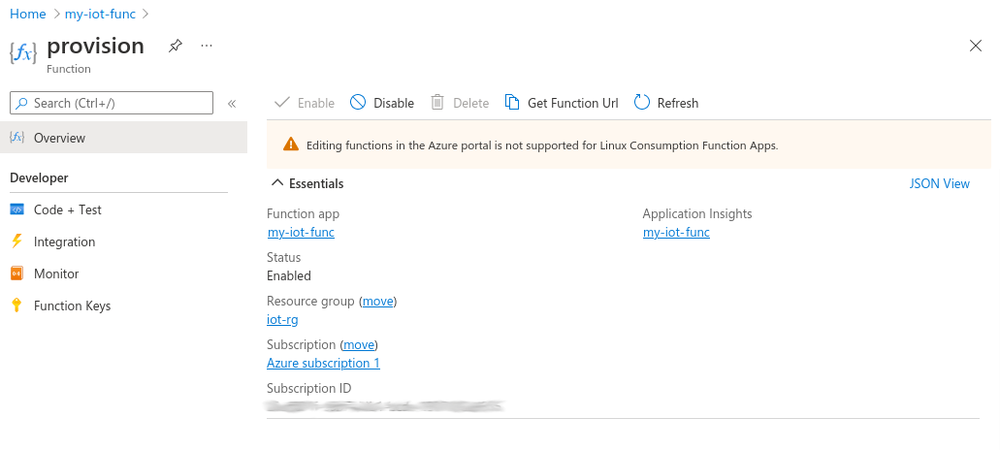

# Microsoft Azure Function for IoT Device Provisioning
This Azure Function allows you to provision and synchronize a balena device with Azure IoT in a secure and automated way via an HTTP endpoint. The Azure Function may be called by a balena device, as seen in the [cloud-relay](https://github.com/balena-io-examples/cloud-relay) example.

| Method | Actions |
|---------|---------|
| POST | Provisions a balena device with Azure IoT. First the function verifies the device UUID with balenaCloud. Then it creates a public key certificate and registers the device with IoT Hub. Finally the function sets balena device environment variables for these entities. |
| DELETE | Removes a balena device from the IoT Hub and removes the balena device environment variable. Essentially reverses the actions from provisioning with POST. |

## Device Environment Variables
Once the Azure function has provisioned the device with Azure, it sets balena device environment variables as described below, which allow the device to connect to IoT Hub.

| Variable | Value |
|----------|-------|
| AZURE_CERT | Public key certificate in PEM format, base64 encoded to eliminate line wrapping |
| AZURE_PRIVATE_KEY | Private key in PEM format, base64 encoded to eliminate line wrapping |

## Setup and Testing
### Azure setup
The Azure Function interacts with Azure IoT via NodeJS code operating with read/write privileges on an IoT Hub. First you must setup an Azure IoT Hub with an associated Resource group. See the [CLI](https://docs.microsoft.com/en-us/azure/iot-develop/quickstart-send-telemetry-iot-hub?pivots=programming-language-nodejs#create-an-iot-hub) or [Portal](https://docs.microsoft.com/en-us/azure/iot-hub/iot-hub-node-node-device-management-get-started#create-an-iot-hub) based instructions. Also see the IoT Hub [documentation](https://docs.microsoft.com/en-us/azure/iot-hub/) for background.

### Workspace setup
To get started, you must set up a workspace to build the function. See the Azure Functions [JavaScript quickstart](https://docs.microsoft.com/en-us/azure/azure-functions/create-first-function-cli-node) for background, and run these commands:

```
# get a local copy of provisioning code
git clone https://github.com/balena-io-examples/azure-iot-provision provision-repo

# create workspace
func init provision-func --javascript \
   && cd provision-func \
   && func new --name provision --template "HTTP trigger" --authlevel "anonymous"

# copy provisioning code into workspace
cp ../provision-repo/index.js provision \
   && cp ../provision-repo/function.json provision \
   && cp ../provision-repo/package* . \
   && npm install

# copy testing and deployment scripts into workspace
cp ../provision-repo/tools/*.sh . \
   && echo -e '*.sh\n*.pem' >.funcignore
```

Finally, you must edit the `run-local-server.sh` and `create-func.sh` scripts copied above to provide these environment variables:

|    Key      |    Value    |
|-------------|-------------|
| BALENA_API_KEY | for use of balena API; found in balenaCloud dashboard at: `account -> Preferences -> Access tokens` |
| CONNECTION_STRING | for read/write access to IoT Hub; found in the Azure Portal at: `IoT Hub -> Shared access policies -> registryReadWrite -> Primary connection string` |

### HTTP API
The HTTP endpoint expects a request containing a JSON body with the attributes below. Use POST to add a device to the cloud registry, DELETE to remove.

| Attribute | Value |
|-----------|-------|
| uuid | UUID of device  |
| balena_service | (optional) Name of service container on balena device that uses provisioned key and certificate, for example `cloud-relay`. If defined, creates service level variables; otherwise creates device level variables. Service level variables are more secure. |

### Test locally
Start the local server by running `run-local-server.sh`.
Edit `test-provision.sh` to set a valid device UUID for provisioning and balena service name, and then run the file with either a `POST` or `DELETE` parameter to send the HTTP request.

After a successful POST, you should see the device appear in your IoT Hub registry, and `AZURE_CERT` and `AZURE_PRIVATE_KEY` variables appear in balenaCloud for the device and service. After a successful DELETE, the device and those variables disappear.

## Deploy
To deploy to Azure Functions, you first must create a storage account and the function application in Azure itself. Edit `create-func.sh` to initialize all of the variables, and then run it.

It may take a few minutes for the Function app to become available. Then deploy the provisioning code with the command below, substituting the name of the app from `create-func.sh` for `xxxx`.

```
$ func azure functionapp publish xxxx

...
Functions in xxxx:
    provision - [httpTrigger]
        Invoke url: https://xxxx.azurewebsites.net/api/provision
```

To test the deployment, first edit `test-provision.sh` to use the `Invoke url` shown above in the response, and then run the script.

After a successful POST, you should see the device appear in your IoT Hub registry, and `AZURE_CERT` and `AZURE_PRIVATE_KEY` variables appear in balenaCloud for the device. After a successful DELETE, the device and those variables disappear.


